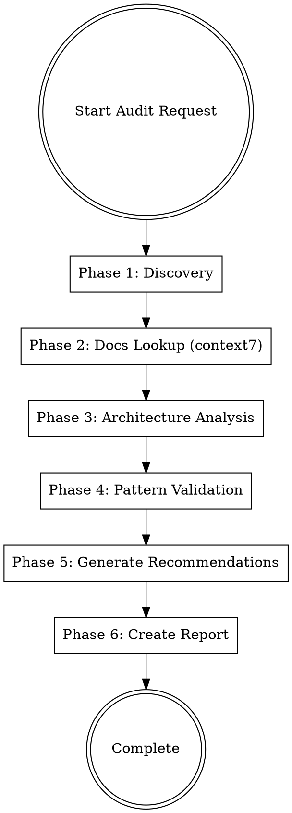

# Auditing Frontend Architecture

## Overview

Systematic process for auditing frontend architecture, design patterns, and configurations. **Core principle:** Always verify against up-to-date official documentation using context7, not assumptions.

## When to Use

Use this skill when:
- User requests architecture audit or review
- Evaluating a new codebase for quality/scalability
- Creating a project template or boilerplate
- Before major refactoring decisions
- Onboarding to a project and need comprehensive overview

**Do NOT use for:**
- Quick code reviews (use code-reviewer skill)
- Bug fixing (use systematic-debugging skill)
- New feature implementation

## The Audit Process



## Phase 1: Discovery

**CRITICAL: Use TodoWrite to create todos for EACH phase.**

Gather project information:

1. **Read package.json** - Identify framework versions, dependencies
2. **Read tsconfig.json/jsconfig.json** - TypeScript config, path aliases
3. **Read configuration files** - ESLint, Prettier, testing configs
4. **Map directory structure** - Use Glob/Bash to understand organization
5. **Identify key files** - Main entry points, providers, routing structure

**Extract:**
- Framework + version (Next.js, React, Vite, etc.)
- State management libraries (Zustand, Redux, Jotai, etc.)
- Data fetching libraries (TanStack Query, SWR, RTK Query, etc.)
- UI libraries (Radix, Material-UI, Chakra, etc.)
- Testing framework (Vitest, Jest, Playwright, etc.)
- Build tools (Webpack, Vite, Turbopack, etc.)

## Phase 2: Documentation Lookup (MANDATORY)

**YOU MUST USE CONTEXT7 - This is NOT optional.**

**Violating this = invalid audit.** Recommendations based on outdated knowledge will mislead users.

**CRITICAL:** Phases must be executed in order (1→2→3→4→5→6). Do NOT skip Phase 2.

For EACH major library/framework identified in Phase 1:

1. **Use resolve-library-id** to find the library:
```typescript
// Example
mcp__context7__resolve-library-id({
  query: "auditing Next.js 16 best practices",
  libraryName: "Next.js"
})
```

2. **Use query-docs** to fetch current best practices:
```typescript
mcp__context7__query-docs({
  libraryId: "/vercel/next.js",  // from resolve step
  query: "App Router best practices, middleware, metadata API, image optimization"
})
```

**Required lookups (based on stack):**
- Framework best practices (Next.js, React, etc.)
- State management patterns (Zustand, Redux, etc.)
- Data fetching patterns (TanStack Query, SWR, etc.)
- Testing best practices (Vitest, Playwright, etc.)

**Why this matters:** Your knowledge cutoff is January 2025. A project using Next.js 16 or React 19 may have features you don't know about. Context7 ensures you recommend current, not outdated, practices.

## Phase 3: Architecture Analysis

Analyze project structure against discovered best practices:

**Analyze:**
- Directory organization (feature-based vs layer-based)
- Code organization (isolation, shared layer, path aliases)
- Configuration (TypeScript, ESLint, build, testing) against Phase 2 docs

**Check:**
- ✅ Clear separation, consistent naming, logical grouping
- ❌ Deep nesting (>5 levels), inconsistent naming, circular deps

## Phase 4: Pattern Validation

**Validate against Phase 2 findings:**
- State management (server vs client state, typing, selectors)
- Data fetching (queries, caching, loading/error states)
- Component patterns (composition, server vs client components)
- Error handling (boundaries, logging, fallback UI)
- Accessibility (ARIA, semantic HTML)

**Key question:** Does implementation follow library's current best practices from context7?

## Phase 5: Generate Recommendations

**CRITICAL RULES:**

1. **NO TIME ESTIMATES** - Never say "this will take 1-2 weeks"
2. **Prioritize by impact** - Use Priority 1 (Critical), 2 (High), 3 (Medium)
3. **Provide code examples** - Show specific implementation, not generic advice
4. **Reference official docs** - Link to context7 findings
5. **Be specific** - "Add generateMetadata to app/layout.tsx" not "improve SEO"

**Recommendation template:**

```markdown
### Priority 1 (Critical)

**Issue:** Missing route protection for authenticated routes

**Impact:** Unauthenticated users can access protected pages

**Solution:** Implement middleware for route protection

**Example (from Next.js docs):**
```typescript
// middleware.ts
import { NextResponse } from 'next/server'
import type { NextRequest } from 'next/server'

export function middleware(request: NextRequest) {
  const token = request.cookies.get('auth-token')

  if (!token && request.nextUrl.pathname.startsWith('/dashboard')) {
    return NextResponse.redirect(new URL('/login', request.url))
  }
}

export const config = {
  matcher: '/dashboard/:path*'
}
```

**Reference:** [Next.js Middleware Docs](https://nextjs.org/docs/app/building-your-application/routing/middleware)
```

## Phase 6: Create Report

Generate `AUDIT.md` with:

1. **Executive Summary** - Score, strengths, critical issues
2. **Project Overview** - Framework versions, key libraries
3. **Architecture Analysis** - Structure, strengths, weaknesses
4. **Comparison Tables** - Framework best practices, standards alignment
5. **Recommendations** - Priority 1/2/3 with code examples (NO time estimates)
6. **Configuration Checklist** - Completed/missing items
7. **Conclusion** - Verdict, production-readiness

**Required footer:** `*Audited with context7: Yes*`

## Quick Reference

| Phase | Key Action | Tool |
|-------|------------|------|
| Discovery | Read configs, map structure | Read, Glob, Bash |
| Docs Lookup | Query official docs | context7 (resolve-library-id, query-docs) |
| Architecture | Analyze organization | Read key files |
| Pattern Validation | Compare against best practices | Context7 findings + code review |
| Recommendations | Generate prioritized list | Analysis synthesis |
| Report | Create AUDIT.md | Write |

## Red Flags - STOP if You Think This

| Thought | Reality |
|---------|---------|
| "I know this framework well, don't need context7" | Your knowledge cutoff is Jan 2025. Projects may use newer versions. |
| "context7 is slow, I'll skip it" | Slow but accurate > fast but wrong. Invalid audit if skipped. |
| "I'll do Phase 3 before Phase 2" | Phase 2 informs Phase 3. Must follow order. |
| "I don't need TodoWrite for phases" | TodoWrite tracks progress and prevents skipping steps. Required. |
| "Generic advice is fine" | Users need specific file paths and code examples to act. |
| "Time estimates help users plan" | Against guidelines. Use priorities instead. |

**All of these mean: Stop and follow the skill correctly.**

## Common Mistakes

| Mistake | Fix |
|---------|-----|
| ❌ Skipping context7 | Use context7 for all major libraries - Required |
| ❌ Including time estimates | Use priorities (Critical/High/Medium) instead |
| ❌ Generic recommendations | Provide specific file paths + code examples |
| ❌ Out-of-order phases | Follow 1→2→3→4→5→6 strictly |
| ❌ No TodoWrite | Create todo for each phase - Required |

## Real-World Impact

**Without this skill:**
- Audits based on outdated best practices
- Missing new features/patterns from latest versions
- Generic, non-actionable recommendations
- Inconsistent audit quality

**With this skill:**
- Always up-to-date with official docs
- Specific, actionable recommendations
- Consistent audit structure
- Better developer experience
